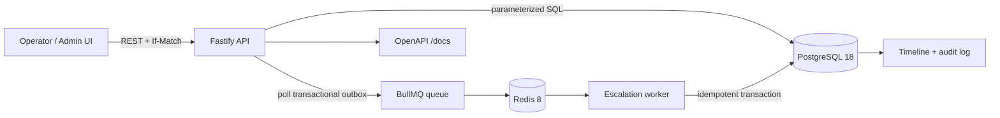
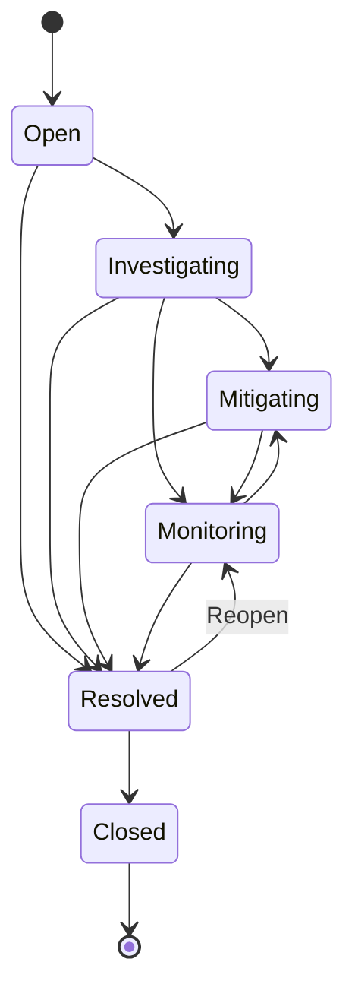

# Incident Operations Platform

[](https://github.com/German4341374/incident-operations-platform/actions/workflows/ci.yml)
[](LICENSE)
[](https://nodejs.org/)

Incident Operations Platform is a compact incident-management system for an operations or technical-support team. It keeps the incident record, collaboration timeline, immutable audit trail, SLA deadlines, and queue-driven escalations in one reproducible local stack.

The project deliberately focuses on incident operations. It does not implement customer accounts, chat, paging vendors, or a distributed microservice topology.

## Features

- Register P1–P4 incidents with automatic first-response and resolution deadlines.
- Assign engineers and move incidents through an enforced state machine.
- Add general comments and explicit mitigation notes.
- Link similar incidents without duplicate or self-referential links.
- Read an operational timeline and a separate before/after audit log.
- Protect concurrent updates with `If-Match` optimistic locking.
- Filter by status, priority, and assignee; paginate and use PostgreSQL full-text search.
- Inspect dashboard totals, active P1 incidents, resolution breaches, and mean resolution time.
- Schedule durable escalation jobs through a PostgreSQL outbox and BullMQ.
- Explore an OpenAPI 3.1 document and a responsive administrative interface.
- Run integration, container, and dependency-free load smoke tests in GitHub Actions.

## Architecture



An incident and its two SLA outbox rows are committed atomically in PostgreSQL. The API's dispatcher copies pending outbox messages to BullMQ. A separate worker processes delayed jobs and writes an escalation only after claiming the same idempotency key in PostgreSQL. Redis is therefore transport, not the system of record.

See [Architecture and consistency](docs/architecture.md) for the detailed write path and trade-offs.

## Incident state machine



An update to the same status is idempotent. `Closed` is terminal. Reopening is intentionally explicit: `Resolved → Monitoring`. Assignment or the first transition beyond `Open` records `firstRespondedAt`.

The full transition table and lifecycle rationale are in [Incident lifecycle](docs/state-machine.md).

## SLA policy

| Priority | First response | Resolution |
| -------- | -------------: | ---------: |
| P1       |     15 minutes |    4 hours |
| P2       |         1 hour |    8 hours |
| P3       |        4 hours |   24 hours |
| P4       |        8 hours |   72 hours |

Changing priority recalculates both deadlines from the original creation time. New outbox keys are created; jobs for superseded deadlines are safely skipped by the worker.

## Technology stack

- TypeScript 6 in strict mode and Node.js 24
- Fastify 5 with OpenAPI and Swagger UI
- PostgreSQL 18 with generated `tsvector`, GIN indexes, constraints, and transactions
- Redis 8 and BullMQ 6
- Vitest, V8 coverage, ESLint, Prettier, and native Node.js load runner
- Multi-stage Docker image and Docker Compose
- GitHub Actions and Dependabot

All direct npm dependencies are exact-version pinned and reproducible through `package-lock.json`. Container tags are version-pinned; the PostgreSQL image is also digest-pinned.

## Quick start with Docker

Prerequisites: Docker Engine with Compose v2. Windows users can run the same commands from WSL2 with Docker Desktop integration enabled.

```bash
cp .env.example .env
docker compose up --build --wait
```

Open:

- Administrative UI: <http://localhost:3000>
- OpenAPI UI: <http://localhost:3000/docs>
- Readiness: <http://localhost:3000/ready>

The migration service runs before the API and worker start. The first migration also loads five deterministic demonstration incidents and three fake engineers.

```bash
docker compose logs --follow api worker
docker compose down
docker compose down --volumes  # destructive: removes local PostgreSQL and Redis data
```

Change `POSTGRES_PASSWORD` in `.env` before using a shared machine. Do not reuse the example value outside local development.

## Local Node.js development

Use Node.js 24 plus reachable PostgreSQL and Redis instances. Set `DATABASE_URL` and `REDIS_URL` to localhost endpoints, then run:

```bash
npm ci
npm run migrate
npm run dev
```

Start the worker in another terminal:

```bash
npm run dev:worker
```

Useful commands:

```bash
npm run format:check
npm run lint
npm run typecheck
npm run test:coverage
npm run build
npm audit --audit-level=moderate
```

Integration tests run when both `TEST_DATABASE_URL` and `TEST_REDIS_URL` are present. Without them, Vitest reports those tests as skipped instead of pretending that external dependencies were checked.

## REST API

| Method  | Path                          | Purpose                                   |
| ------- | ----------------------------- | ----------------------------------------- |
| `GET`   | `/health`                     | Process liveness                          |
| `GET`   | `/ready`                      | PostgreSQL and Redis readiness            |
| `GET`   | `/api/dashboard`              | Operational metrics                       |
| `GET`   | `/api/engineers`              | Assignable engineers                      |
| `POST`  | `/api/incidents`              | Register incident and SLA outbox messages |
| `GET`   | `/api/incidents`              | Filter, search, and paginate              |
| `GET`   | `/api/incidents/:id`          | Incident and related incidents            |
| `PATCH` | `/api/incidents/:id`          | Optimistic lifecycle/assignment update    |
| `POST`  | `/api/incidents/:id/comments` | Add comment or mitigation                 |
| `POST`  | `/api/incidents/:id/links`    | Link a similar incident                   |
| `GET`   | `/api/incidents/:id/timeline` | Chronological event stream                |
| `GET`   | `/api/incidents/:id/audit`    | Immutable before/after audit data         |

Create an incident:

```bash
curl --request POST http://localhost:3000/api/incidents \
  --header 'content-type: application/json' \
  --header 'x-actor: Operations Desk' \
  --data '{
    "title": "Checkout requests fail in Europe",
    "description": "Customers receive gateway errors during checkout.",
    "priority": "P1",
    "reportedBy": "Operations Desk"
  }'
```

Update it using the version returned in the body or `ETag` header:

```bash
curl --request PATCH http://localhost:3000/api/incidents/INCIDENT_UUID \
  --header 'content-type: application/json' \
  --header 'if-match: "1"' \
  --header 'x-actor: Alex Morgan' \
  --data '{"status":"Investigating","assigneeId":"ENGINEER_UUID"}'
```

A stale version returns HTTP `409` with the expected and current versions. A missing `If-Match` returns HTTP `428`.

Search and filter:

```bash
curl 'http://localhost:3000/api/incidents?query=authentication&priority=P1&page=1&pageSize=20'
```

All errors use a safe JSON envelope:

```json
{
  "error": {
    "code": "CONFLICT",
    "message": "Incident was modified by another request",
    "details": { "expectedVersion": 2, "currentVersion": 3 },
    "requestId": "req-14"
  }
}
```

## End-to-end incident scenario

The scripted demonstration creates a P1 incident, assigns an engineer, waits for an automatic resolution escalation, adds mitigation, moves through Monitoring, resolves and closes, then reads both histories.

Use the accelerated clock only in development:

```bash
SLA_TIME_FACTOR=0.005 docker compose up --build --wait
npm ci
npm run demo:scenario
```

At factor `0.005`, the P1 resolution deadline is about 72 seconds. Production startup rejects any factor other than `1`. See [Demonstration scenario](docs/demo-scenario.md).

## Load smoke test

The dependency-free runner exercises liveness, incident listing, dashboard reads, and incident creation with bounded concurrency. It fails on transport errors, any non-2xx response, or p99 latency above two seconds.

```bash
LOAD_DURATION_SECONDS=3 LOAD_CONNECTIONS=10 npm run load:smoke
```

It writes `artifacts/load-smoke.json`, which is ignored by Git and uploaded by CI. The documented measured baseline is in [Load smoke results](docs/load-test-results.md). Results are smoke evidence from a shared CI runner, not a capacity forecast.

## Consistency and reliability

- **Idempotency:** one logical escalation key is enforced by the outbox, BullMQ `jobId`, and the execution table.
- **Concurrent updates:** `If-Match` is compared against a locked row; PostgreSQL updates only the expected version and increments it atomically.
- **Retry:** BullMQ makes five attempts with exponential delays beginning at two seconds. Completed jobs are retained for one day and terminal failures for seven days.
- **Redis failure:** incident writes remain durable in PostgreSQL; undispatched outbox rows are retried after Redis recovers.
- **PostgreSQL failure:** readiness fails, API data operations fail closed, and worker transactions roll back for BullMQ retry.
- **Worker crash:** an uncommitted execution rolls back; a committed idempotency key prevents a duplicate escalation after restart.

See [Failure modes and runbook](docs/failure-modes.md) for detection, impact, recovery, and reconciliation queries.

## Security considerations

- Docker runs the API and worker as the non-root `node` user with all Linux capabilities dropped, a read-only filesystem, and `no-new-privileges`.
- PostgreSQL and Redis are on an internal Docker network and have no host ports.
- SQL is parameterized; request bodies have size limits and strict validation.
- Logs redact authorization and cookie headers. Example data uses reserved `.test` email addresses.
- The project contains no real credentials. `.env` and load artifacts are ignored.
- The administrative interface intentionally has no authentication. Keep it local or place it behind an authenticated reverse proxy before shared use.

## Limitations

- No authentication, authorization, tenant isolation, paging provider, email, or chat integration.
- Redis is a single local instance; PostgreSQL is a single local instance.
- Dashboard metrics are calculated directly rather than pre-aggregated.
- The audit log is application-managed, not cryptographically signed or externally archived.
- English text search configuration is fixed in the migration.
- CI load results validate regressions on a shared runner; they do not establish production capacity.

## Repository layout

```text
database/migrations/  PostgreSQL schema and deterministic demo data
public/               Administrative interface
scripts/              End-to-end scenario and load smoke runner
src/db/               Pool, migration, and seed commands
src/domain/           SLA policy and incident state machine
src/queue/            Transactional outbox dispatcher and BullMQ setup
src/repositories/     Parameterized SQL and transaction boundaries
src/services/         Application orchestration
tests/                Unit and PostgreSQL/Redis integration tests
docs/                 Architecture and operational runbooks
```

## License

Licensed under the [MIT License](LICENSE).
