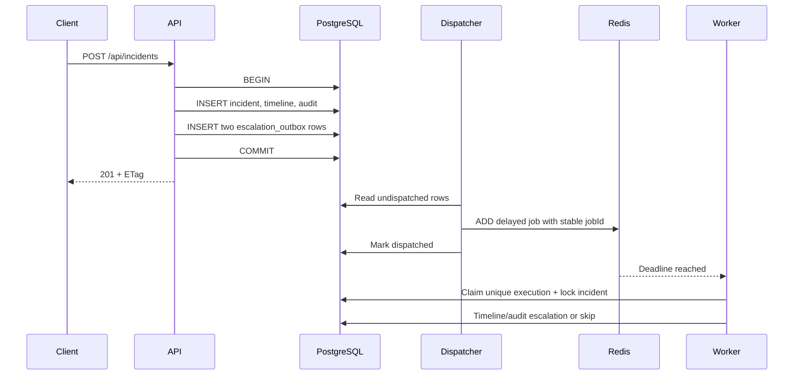

# Architecture and Consistency

## Components

The Fastify process serves REST, OpenAPI, static administration assets, liveness, and readiness. PostgreSQL is the authoritative store for incidents, comments, links, timeline events, audit records, SLA outbox rows, and escalation executions. Redis holds BullMQ's delayed job transport. The worker has no HTTP surface and only processes the escalation queue.

## Incident creation path



The response does not depend on Redis. The best-effort immediate dispatch runs asynchronously, while a periodic five-second scan repairs missed dispatches.

## Idempotency strategy

The logical key is:

```text
escalation--<incident UUID>--<first_response|resolution>--<deadline epoch milliseconds>
```

Three layers use the same value:

1. `escalation_outbox.idempotency_key` has a unique constraint, preventing duplicate intent in PostgreSQL.
2. BullMQ receives it as `jobId`, deduplicating repeated dispatch attempts while a job exists.
3. `escalation_executions.idempotency_key` has a unique constraint. The worker claims it inside the same transaction that writes the timeline and audit records.

The database constraint is the final authority because Redis retention eventually removes completed jobs. If two workers receive duplicates, only one execution transaction can claim the key. Reprioritization produces new keys because deadlines change. Old jobs compare their deadline with the current incident row and exit as `superseded_deadline`.

## Optimistic locking

Every incident has a positive integer `version`. A client reads a representation and its `ETag`, then sends `If-Match` when patching. The repository:

1. starts a transaction;
2. selects the incident `FOR UPDATE`;
3. compares the supplied and current versions;
4. validates the state transition;
5. updates with `WHERE id = ? AND version = ?` and increments the version;
6. writes timeline and before/after audit records in the same transaction.

Stale clients receive HTTP `409`, including both versions, and must fetch current state before retrying. This avoids last-write-wins data loss. Comment appends and incident links are independent resources and do not require the incident version.

## PostgreSQL design

- Native enums constrain status, priority, comment type, and escalation type.
- Database checks enforce field lengths, deadline ordering, and terminal timestamp consistency.
- `search_document` is a stored generated `tsvector`, indexed with GIN.
- Partial indexes cover unresolved resolution deadlines and undispatched outbox rows.
- Similar incident pairs are normalized by UUID order, then protected by a composite primary key.
- Migrations use an advisory lock and a `schema_migrations` ledger.

## Trade-offs

The outbox adds a table and polling delay but prevents the dual-write gap between PostgreSQL and Redis. Optimistic locking makes clients handle conflicts but avoids holding database locks across user think time. A standalone worker is more operational work than in-process timers, but it permits independent concurrency and graceful queue draining.
